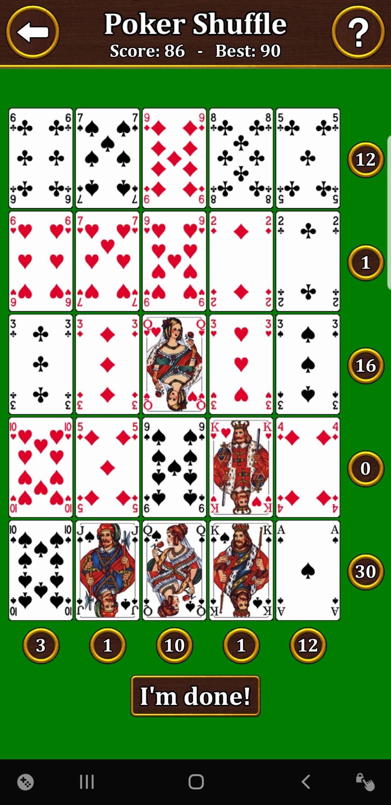

# Playing Poker Squares with Simulated Annealing

**Poker Squares** (aka Poker Solitaire) is a patience game. There are 25 cards in a 5x5 grid. Each row and column forms a poker hand with a score, which is added up to give a total score. The game aims to arrange the cards in the grid to maximize the total score, so it's a Combinatorial Optimization Problem.

	

There are many variations in terms of game style and scores. In this work, we adopt a game style (sometimes called **Poker Shuffle**) in which it is possible to permutate the cards on the grid without restrictions. Also, we adopt the *English Point System* [Wikipedia](https://en.wikipedia.org/wiki/Poker_squares). 

Despite their simplicity, exactly solving a Poker Square game is prohibitive because there are $\frac{25!}{(5!)^2}\approxeq 10^{21}$ possible permutations of cards. So, we shall tackle the problem using some other approach.

In this project we play Poker Squares using **Simulated Annealing**, a Metaheuristic and Monte Carlo-type Algorithm based on the **Metropolis-Hastings** - in turn, one of the most important algorithms of the 20th century. Although there is no guarantee of achieving the global optimum, the practical solutions are usually good.

With a simple implementation, I got a mean score of 78 — above my own average and probably above the average of an average human — and a maximum score of 131; this would be in the top 3 of the ranking of [Poker Solitaire by Bearded Whale](https://www.amazon.com/Bearded-Whale-Poker-Solitaire/dp/B074N3K6NQ). I used exponential annealing, changing every step, starting with T=5 and ending with T=0.001, 10,000 steps. I ran 1,000 games. **2024/May/11 update**: Unfortunately, the game is no longer available in Google Play Store.

Also, I was able to get 4,500 points using the same point system and initial tableau proposed by [McLaughlin, 1989](http://dns.uls.cl/~ej/daa_08/Algoritmos/books/book10/8909b/8909b.htm), while he got 4,516 but with a more complex algorithm.

The students voted this the best work of class 2020/2 in the discipline [COS765](https://www.cos.ufrj.br/~daniel/rc/) — Complex Networks.
